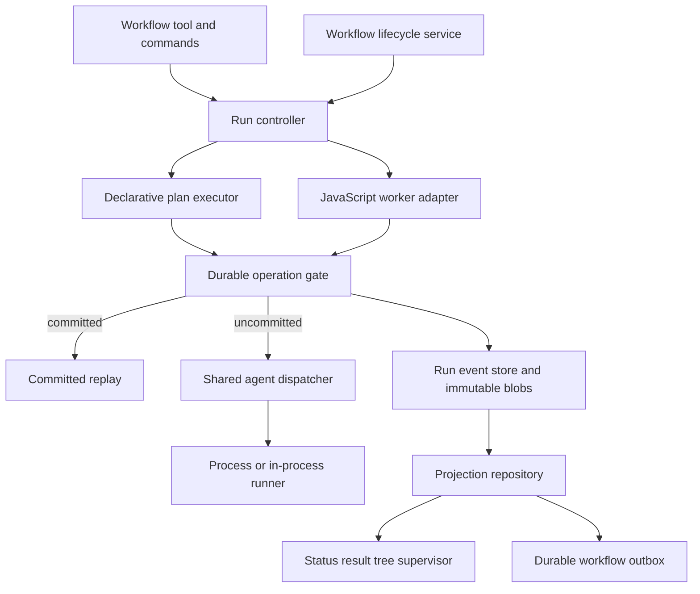

# Workflow Redesign Plan

Status: approved  
Repository baseline: `master@901b7c574e215931443bfb5a616d7e6e5cc5fe3a` (`pi-subagentura` 3.3.0)  
Review date: 2026-08-06

## 1. Purpose

This document consolidates the findings, caveats, design corrections, and
implementation proposals from the review of historical external inputs supplied
on the reviewing workstation:

- `/Users/applesucks/Downloads/Telegram Desktop/2026-08-06_120423-omp-style-declarative-workflows.md`
- `/Users/applesucks/Downloads/Telegram Desktop/2026-08-06_120423-workflow-redesign-rollout.md`
- `/Users/applesucks/Downloads/Telegram Desktop/2026-08-06_120423-pi-subagentura-mode-a-durability.md`
- GitHub issue #82, `feat(workflow): make workflow runs durable and resumable`

Reviewed file fingerprints:

- OMP-style plan:
  `a679dcedf6d14ec5e0782b8791eb09cc24f36bb03e727e1fc2ee7b5f57f43ebd`
- Rollout plan:
  `c183768fcff8780664013a99c749b78b0580298ee04beb279c544b2f8e87b946`
- Mode A plan:
  `d2b3743dc6a735d77cf837d9cb955161f4c69f1e1df8d56f4e903366e1cf7f00`

The following command reproduces the fingerprints only on a machine where those
historical absolute paths still exist:

```bash
sha256sum \
  '/Users/applesucks/Downloads/Telegram Desktop/2026-08-06_120423-omp-style-declarative-workflows.md' \
  '/Users/applesucks/Downloads/Telegram Desktop/2026-08-06_120423-workflow-redesign-rollout.md' \
  '/Users/applesucks/Downloads/Telegram Desktop/2026-08-06_120423-pi-subagentura-mode-a-durability.md'
```

The paths are machine-specific and are not a generally reproducible project
input. This consolidated `plan.md` is the implementation contract. The approval
review also referenced newer `.hermes/plans` variants that are not present in
this repository or at the supplied paths; their automatic-routing requirement
is incorporated normatively below. If the historical inputs are later committed
under repository-relative paths, update this provenance and the fingerprints.

The goal is not to replace the detailed documents line for line. This is the
corrected canonical integration plan that freezes cross-layer contracts and
defines a safe implementation order.

## 2. Executive decision

The redesign is **doable with revisions**.

Three distinct judgments apply:

- Non-durable declarative workflow preview: **GO**.
- Narrow sequential durable vertical slice: **conditional GO** after the
  contracts in this document are frozen.
- Full Mode A implementation as currently written: **NO-GO** until replay
  ordering, nested definitions, concurrency, resume authority, ownership, and
  state-machine behavior are specified.

No new daemon, remote coordinator, native database, or third-party workflow
runtime is required. The current parent/worker RPC boundary, artifact protocol,
delivery broker, owner fencing, and workflow UI provide viable integration
seams.

This is a program-sized redesign and must ship through independently testable
vertical slices. A run-store scaffold alone must never be presented as durable
workflow execution.

## 3. Product contract

### 3.1 In scope

- Named declarative plans with ordered phases and stable task IDs.
- Sequential and, later, bounded parallel agent tasks.
- Coordinator-owned task execution and terminal status.
- Same-host, same-real-cwd, same-Pi-session local recovery.
- Explicit durable operation IDs and canonical request digests.
- Replay of committed outcomes without repeating model work.
- New attempts for uncommitted or interrupted work under documented
  at-least-once semantics.
- Durable status, result, cancellation, accounting, delivery intent, and
  trusted approval state.
- Process-child adoption or fenced retry after the launch protocol is proven.
- Exact versus lower-bound accounting provenance.
- Revisioned mutations of future declarative work.
- Bounded context restoration and guarded incomplete-work reminders.
- Legacy JavaScript workflow compatibility when durability is not requested.
- Automatic routing of eligible complex parent requests into a phased durable
  declarative plan: host-enforced lanes start in the same turn, while
  minimum-SDK model-policy lanes report observed or unconfirmed routing.
- Human plan view, export, edit, append, and skip commands with stable-ID
  round-trip and stale-editor rejection.

### 3.2 Explicit non-goals

- Execution while no compatible Pi process is running.
- Remote execution, multi-host scheduling, cron, or generic worker fleets.
- Exactly-once filesystem, network, shell, or third-party API side effects.
- Serialization of closures, Promises, VM stacks, or arbitrary JavaScript
  runtime state.
- Transparent durability for operations without explicit stable IDs.
- Treating the workflow VM as a security boundary.
- Inferring identity from labels, phase names, source locations, or timestamps.
- Making legacy JavaScript workflows durable by default.
- Replacing the current runtime with Smithers, Temporal, LangGraph, or another
  coordinator.
- Adding a native SQLite dependency or increasing the Node/Pi minimum versions.

### 3.3 Authority invariants

- One run has exactly one authoritative durable store.
- Complete physical NDJSON line order is authoritative; timestamps are metadata.
- The parent coordinator, never the worker/model/UI, commits execution success or
  failure.
- UI, transcript messages, context injection, and tree rows are projections.
- A terminal task remains in history and cannot return to a running state.
- A committed logical outcome is replayable and cannot invoke the model again.
- A stale owner, worker epoch, attempt, mutation revision, or approval cannot
  mutate current state.
- Delivery is at least once. The dispatch-before-receipt crash window may
  duplicate, but must not lose, a notification.

### 3.4 Automatic complex-task routing

The intended host-enforced experience is:

```text
eligible complex natural request
-> construct and validate a bounded phased declarative plan
-> create workflow({ plan, durable: true })
-> start execution in the same parent turn
```

One configuration surface, `workflow-eager`, controls routing:

| Value       | Contract                                                                                                           |
| ----------- | ------------------------------------------------------------------------------------------------------------------ |
| `off`       | Never route natural requests automatically; explicit workflow tools and commands remain available.                 |
| `preferred` | Route only when the request has at least two independent agent-worthy slices or needs phased durable continuation. |
| `always`    | Route every eligible parent request, subject to the mandatory suppressions below.                                  |

`always` still suppresses pure questions, social conversation, plan-only
requests, turns awaiting user input, workflow-management commands, child
contexts, and continuation of an active workflow. It does not mean every user
turn becomes executable workflow work.

Two capability lanes are explicit:

#### Host-enforced lane

When the host can invoke the controller directly or force the workflow tool,
same-turn validated run creation and execution start are hard acceptance
requirements.

#### Minimum-SDK/model-policy lane

When the host only supports `before_agent_start` instruction injection:

```text
eligible request
-> strongly instruct the parent model to create and call the workflow
-> observe whether the workflow call occurs
-> report routing_unconfirmed when it does not
```

Same-turn start is best effort in this lane and must never be reported as
host-enforced.

Routing rules:

- the decision occurs before direct-path side effects or child-agent dispatch;
  after direct execution begins, the extension must not retroactively create a
  duplicate workflow;
- direct questions, one-command operations, and single focused fixes remain on
  the direct path under `preferred`;
- `PI_SUBAGENTURA_CHILD=1` and in-process subagent orchestration contexts never
  eager-route;
- when an active workflow already owns the request, inspect or continue that run
  instead of creating a duplicate unless the user explicitly requests an
  independent run;
- generated plans validate before workflow-job creation or child-agent dispatch;
  the parent model may already be running while constructing the plan;
- plan construction receives one bounded correction attempt; persistent
  construction, validation, or tool-capability failure surfaces the exact error
  and never silently invokes legacy `/workflow <task>`;
- `/workflow-plan create <task>` is the host-owned declarative fallback. It
  directly invokes the bounded planner, validator, and controller path rather
  than injecting another follow-up prompt;
- existing `/workflow <task>` remains an explicit model-mediated,
  non-deterministic legacy JavaScript path that is non-durable by default.
  Automatic routing never invokes it as fallback;
- automatic routing remains opt-in and defaults to `off` until the Milestone 8
  default-enablement gate;
- local tests and benchmarks record eligible-request routing, same-turn start in
  the host lane, policy-lane compliance, `routing_unconfirmed`, simple-task
  avoidance, child suppression, duplicate-run avoidance, failure handling, and
  false-positive rates. No user-data telemetry is introduced.

## 4. Current architecture findings

### 4.1 Reusable seams

1. The VM already calls the parent through a closed worker RPC contract.
   `src/workflow-worker.ts:296-398` invokes the real runner, and
   `src/workflow-worker.ts:621-637` acknowledges the worker. This is the correct
   insertion point for an operation gate and commit-before-ack.
2. Workflow execution already separates the parent host from the worker thread
   and VM (`src/workflow-worker.ts`, `src/workflow-worker-thread.mjs`).
3. The interactive protocol supplies reusable byte-cursor logic, bounded
   records, containment checks, immutable snapshots, atomic replacement, and
   delivery intent/receipt patterns (`src/artifact.ts`, `src/delivery.ts`,
   `src/rehydrate.ts`). It is not already a durable workflow journal or outbox.
4. Session scope generation already fences late callbacks
   (`src/session-scope.ts:191-264`).
5. Process launch persists addressable child state after pane creation and
   before sending the launch command
   (`src/interactive-tmux.ts:643-680,727-751`). This is reusable ordering, but
   the create-pane/persistence crash window remains open.
6. The workflow tree, status, result, cancellation, and notification surfaces
   already exist and can consume a projection repository.
7. The current Acorn parser is sufficient for metadata parsing and optional
   durable preflight checks (`src/workflow-script.mjs`).
8. The current package target and Node 18 filesystem APIs are sufficient for a
   dependency-free journal and immutable blob store.

### 4.2 Current gaps

1. `workflowJobRegistry` is process memory and is the current background
   authority (`src/workflow-jobs.ts:78-94`).
2. Session shutdown suppresses, aborts, cancels, and removes workflow jobs
   (`src/workflow-jobs.ts:140-152`; `src/session-handlers.ts:111-170`).
3. Status and result tools only query a live owner-scoped job and result Promise
   (`src/workflow-tool.ts:680-869`).
4. `WorkflowJobState` is script-specific: it owns one Promise, one abort
   controller, a mutable progress snapshot, and a `WorkflowRunResult`
   (`src/workflow-jobs.ts:27-77`).
5. The tree reads and directly mutates in-memory jobs
   (`src/workflow-tree-ui.ts:125-160`).
6. Current operation identity is a transient numeric agent attempt ID, not a
   durable caller-supplied logical ID.
7. Current worker responses settle in actual completion order. Cold replay can
   change JavaScript microtask ordering if cached results are returned
   immediately.
8. Nested `workflow(name, args)` loads the current saved file. No immutable child
   definition snapshot is bound to the run.
9. Workflow process children are intentionally not persisted for workflow
   recovery. `makeRunAgent` does not pass `parentSessionId`, and persisted
   interactive state has no workflow attempt ID, launch nonce, or run epoch.
10. A hard crash after pane creation but before interactive-state persistence
    can leave a live pane with no durable workflow attempt identity.
11. Existing process/in-process semaphores are private to the JavaScript workflow
    `Engine`. A new declarative runner calling a raw `WorkflowAgentRunner` would
    bypass them.
12. Workflow completion notification is bounded and owner-fenced but not a
    durable workflow outbox.
13. Current accounting can retain observed usage, but it has no durable
    completeness field distinguishing exact committed evidence from a lower
    bound after a crash.

## 5. Critical caveats and required corrections

### 5.1 Choose one identity model

The detailed Mode A plan requires explicit operation IDs. GitHub issue #82 still
describes instrumented callsite IDs, structural branch paths, occurrence
counters, and response ordinals.

Decision:

```text
identity key = (runId, definitionPath, operationId)
```

- plan task IDs become operation IDs directly;
- durable JavaScript requires explicit IDs for `agent()` and nested
  `workflow()` calls;
- the same key plus the same canonical digest joins or replays one logical
  operation; concurrent identical calls pass through one gate and never dispatch
  twice;
- the same key plus a different prompt, options, schema, effective model,
  isolation, or definition digest fails as `duplicate_operation_id` before
  history exists or `replay_diverged` against durable history;
- intentional loop iterations require caller-authored unique IDs, for example:

  ```js
  await agent(prompt, { id: `review-${item.stableId}` });
  ```

- no occurrence counter, timestamp, random value, label, phase, prompt, source
  location, or RPC order becomes inferred identity;
- plan revisions and mutations cannot reuse any historical pending, skipped,
  cancelled, failed, or terminal task ID;
- nested definition paths are canonical, bounded, and immutable within the run;
- issue #82 must be rewritten before implementation so it does not remain a
  competing architecture.

The exact durable nested workflow API must be frozen. A candidate is:

```js
await workflow("child-name", args, { id: "child-review" });
```

Non-durable `workflow(name, args)` remains compatible.

### 5.2 Preserve worker response order

Explicit IDs identify logical operations; they do not preserve JavaScript
execution order.

Current worker RPC responses resolve when each host call completes. On cold
replay, immediately available committed outcomes can settle in a different
order. Scripts using concurrent awaits, shared mutation after `await`, nested
calls, or `Promise.race` can diverge.

Decision:

- ordinal identity is scoped to the durable run plus canonical workflow
  execution/definition path; worker epoch is fencing metadata only;
- each agent and nested-workflow RPC receives a monotonic dispatch ordinal when
  the worker creates the request;
- first execution records a response ordinal when success, null, returned
  error, thrown error, cancellation, schema-retry outcome, or nested-workflow
  response becomes worker-visible;
- dispatch and response ordinals remain immutable across replacement worker
  epochs;
- a replacement epoch may read historical ordinal records but cannot rewrite or
  append as the stale epoch;
- retries create new attempts while retaining the logical operation and response
  position;
- cold replay releases committed responses in recorded response order;
- if the next recorded operation is never requested, a conflicting request
  order appears, or the request digest/definition/path differs, recovery fails
  boundedly as `replay_diverged`; it never waits indefinitely;
- until this is implemented, durable JavaScript is restricted to sequential
  operations and rejects unsupported concurrency before `run_created`.

Tests must cover `Promise.race`, concurrent awaits, shared post-await mutation,
success/null/error/cancellation/schema-retry results, and nested workflow calls.
Response-order reconstruction belongs only to the durable JavaScript milestone;
declarative-plan milestones use their event-driven scheduler and do not inherit
this machinery.

### 5.3 Snapshot nested definitions

A saved child workflow can change between the original run and restart. Reloading
the current file would replay different code under old operation IDs.

Decision:

- Persist the exact child workflow bytes and hash before acknowledging the first
  `loadWorkflow` RPC.
- Bind each child definition hash to its nested workflow path.
- Replay loads the immutable captured definition, not the mutable saved file.
- Changed definitions are allowed only in a new run or an explicit future plan
  revision; they cannot silently alter committed history.

### 5.4 Put the operation gate before the dispatcher

The rollout's statement that existing semaphores will cap a declarative runner
is incorrect. The semaphores are private to the current `Engine` and acquired
inside its JavaScript `runAgentCall` path.

Decision:

- plan and script execution submit logical requests to the same operation gate;
- the gate checks for a committed replay before acquiring a dispatcher slot;
- only a genuinely uncommitted attempt calls the shared dispatcher;
- the dispatcher preserves separate process and in-process concurrency limits;
- plan selectors determine eligibility, while the dispatcher enforces actual
  resource caps;
- the controller/gate commits authoritative execution events; the pure plan
  reducer only consumes those events;
- do not add an unrelated second semaphore or event-authority implementation.

Candidate contracts:

```ts
interface WorkflowOperationGate {
  execute<T>(
    request: WorkflowOperationRequest,
    dispatch: () => Promise<T>,
  ): Promise<T>;
}

interface WorkflowAgentDispatcher {
  run(request: WorkflowAgentRequest): Promise<SubagentResult>;
  close(reason: unknown): void;
  drain(): Promise<void>;
}

operationGate.execute(request, () => dispatcher.run(request));
```

### 5.5 Separate durable owner from live owner

`SessionOwnerToken` is a live in-memory `{id, generation}` fence. It is not a
persistent owner identity.

Decision:

```ts
interface DurableWorkflowOwner {
  projectKey: string; // SHA-256 of canonical real cwd
  piSessionKey: string; // validated or hashed Pi session ID
}

interface LiveWorkflowOwner {
  scopeId: number;
  generation: number;
  leaseToken: string;
  runEpoch: number;
}
```

- Durable lookup uses the durable owner.
- Callback, mutation, dispatch, acknowledgement, and delivery use the live owner
  plus lease token and epoch.
- `new` and `fork` never claim another Pi session's runs.
- Raw persisted paths and unvalidated session IDs are never used as path
  authority.

### 5.6 Freeze lease granularity

The reviewed material alternates between session-level and run-level lease
language. The following contract is normative:

1. One owner-namespace lease provides exclusive process-writer authority for
   `{projectKey, piSessionKey}`.
2. Every run has one monotonic `runEpoch` that fences stale workers, callbacks,
   events, approvals, delivery, and retention actions.
3. Every live run has one in-process append mutex that serializes complete-line
   publication under the namespace lease.
4. Live session generation and an unpredictable lease token fence callbacks
   independently from persistent owner identity.
5. A provably live owner cannot be displaced; verified stale takeover increments
   affected run epochs once; ambiguous liveness or process-start identity fails
   closed.
6. One namespace owner may execute multiple runs, but every run retains its own
   gate, append mutex, epoch, quota accounting, and terminal state.
7. Pi session identity is validated or hashed into a portable path key; raw
   session IDs never become path authority.
8. OS-specific PID/process-start verification is isolated and test-injected for
   macOS and Linux. PID liveness alone is insufficient because of PID reuse.

The namespace lease establishes one process writer. `runEpoch` is a stale-work
fence, not a substitute for exclusive append authority.

### 5.7 Define resume policy and recovery driver

Persist `resumePolicy` in every durable launch snapshot. The normative lifecycle
contract is:

| Lifecycle reason                    | Behavior                                                                 |
| ----------------------------------- | ------------------------------------------------------------------------ |
| `reload`                            | Rehydrate and automatically resume when the persisted policy permits it. |
| `resume`                            | Rehydrate and automatically resume when the persisted policy permits it. |
| Clean `quit` followed by `startup`  | Rehydrate as `interrupted`; require trusted Resume by default.           |
| Process crash followed by `startup` | Rehydrate as `interrupted`; require trusted Resume by default.           |
| `new`                               | Never claim prior-session runs.                                          |
| `fork`                              | Never claim prior-session runs.                                          |

A lifecycle service, not UI rendering or a model reminder, owns resume:

1. acquire the owner-namespace lease;
2. fold current-owner runs;
3. reconcile process children and delivery receipts;
4. project stale `running` state as `interrupted`;
5. apply the persisted policy or expose a trusted Resume action;
6. after a valid Resume, start one executor for the eligible run;
7. retain terminal and non-resumable projections for inspection.

The first crash-recovery test must explicitly invoke trusted Resume before
expecting an interrupted task to receive a new attempt.

### 5.8 Complete task, phase, and run transitions

Task states:

```ts
type WorkflowPlanTaskStatus =
  | "pending"
  | "running"
  | "blocked"
  | "succeeded"
  | "failed"
  | "skipped"
  | "cancelled";
```

Run states:

```ts
type DurableWorkflowStatus =
  | "running"
  | "blocked"
  | "awaiting_budget"
  | "interrupted"
  | "done"
  | "error"
  | "cancelled";
```

Required transition decisions:

- `pending -> running | blocked | skipped | cancelled`
- `blocked -> pending | skipped | cancelled`
- `running -> succeeded | failed | cancelled`
- terminal task states have no outgoing transition;
- a sequential successor is eligible only after predecessor success or skip;
- a failed sequential task stops the run and cancels undispatched successors;
- a failure in a parallel phase closes new dispatch and drains already-running
  siblings before the run becomes `error`;
- user cancellation closes dispatch, cancels pending tasks, signals running
  tasks, drains evidence, and commits run cancellation;
- a run projects `blocked` only when no task is running, no pending task is
  currently eligible, and at least one required task is blocked;
- a parallel phase containing blocked tasks and eligible pending work remains
  `running`, not `blocked`;
- later phases never start while the current phase contains pending, running, or
  blocked tasks;
- `unblock`, `append`, budget approval, and trusted resume publish a wake-up event
  consumed by the single run executor;
- stale revision or epoch mutations reject without partial application.

The initial failure policy is fixed as stop-on-failure. Retry policy, arbitrary
DAG edges, and user-authored failure handlers remain out of scope.

### 5.9 Use a projection repository instead of stretching `WorkflowJobState`

Adding only `kind: "script" | "plan"` to the current job shape is insufficient.
The current Promise/result/abort structure is script-specific.

Proposal:

```ts
interface WorkflowProjectionRepository {
  get(
    owner: DurableWorkflowOwner,
    runId: string,
  ): Promise<WorkflowProjection | undefined>;
  list(owner: DurableWorkflowOwner): Promise<WorkflowProjection[]>;
}

interface WorkflowEventSink {
  append(event: WorkflowRunEvent): Promise<WorkflowEventReceipt>;
}
```

- Non-durable legacy jobs adapt their live state to `WorkflowProjection`.
- For a durable run, the folded durable projection is authoritative for status,
  attempts, usage, result, and terminality.
- A same-epoch live overlay may add only ephemeral progress, stream text, and
  pane/process liveness.
- On any conflict, durable state wins; a stale Promise or registry row cannot
  mask a committed terminal result.
- Status, result, cancellation, tree, notification, and supervisor consume the
  repository/controller rather than filesystem paths or raw job maps.
- UI returns actions. Controllers validate and commit events; UI never mutates a
  durable projection directly.

### 5.10 Process adoption is not part of the first durable claim

Current launch ordering creates the pane before state persistence. A hard crash
in that interval leaves an unrecorded live pane. The corrected process protocol
must use:

1. persist attempt ID, nonce, epoch, deterministic launch intent, and searchable
   launch marker before pane creation;
2. create the pane with a deterministic or recoverably searchable window/pane
   identity;
3. persist the actual pane assignment;
4. append and sync `launch_dispatched` before sending the command;
5. require the child to persist matching `started` evidence before provider
   work;
6. adopt matching live or terminal evidence once;
7. reject old nonce, attempt, or epoch evidence;
8. boundedly probe an ambiguous dispatch, then fence/kill before retry; never
   blindly resend.

The intent-to-pane-assignment crash window must be detectable through the
deterministic identity/search marker or a conservative startup sweep and fence.
Milestone 5 crash tests must kill both before and after pane assignment.

The initial durable vertical slice therefore uses explicit in-process execution
or a test runner. It documents retry and lower-bound accounting rather than
claiming process adoption.

## 6. Recommended architecture



The operation gate checks durable replay before the dispatcher consumes a
concurrency slot. Both plans and scripts use:

```ts
operationGate.execute(request, () => dispatcher.run(request));
```

Dependency rules:

```text
workflow-plan-state     -> pure values only; no I/O, Pi, worker, or time
workflow-plan-runner    -> controller + plan contracts; requests gate execution
workflow-script-adapter -> worker RPC + operation gate; no store paths
workflow-operation-gate -> event sink + store contracts + shared dispatcher
workflow-dispatcher     -> raw runner + semaphores; no durable replay decisions
workflow-run-store      -> run types + durable-value codec only
workflow-recovery       -> store fold + projections + ownership fences
workflow UI             -> projections + controller actions only
session handlers        -> lifecycle service; no journal parsing
workflow delivery       -> terminal projections + durable intents
```

## 7. Durable store proposal

Suggested layout:

```text
~/.pi-subagentura/workflow-runs/v1/
  <project-key>/
    <pi-session-key>/
      owner-lease.json
      runs/
        <run-id>/
          launch.json
          events.ndjson
          state.json
          result.json
          definitions/
            <sha256>.js
          outputs/
            <sha256>.json
```

Store rules:

- Parent derives every path from validated or hashed identifiers.
- Directories use `0700`; files use `0600`.
- Creation is exclusive and no-replace.
- Immutable values are written, synced, published, directory-synced, referenced
  by an appended event, then acknowledged.
- `events.ndjson` is authoritative.
- `state.json` is disposable and rebuildable.
- `result.json` is immutable and bound to an owner, epoch, terminal ID, and base
  event prefix.
- An incomplete final line is ignored for fold, then truncated and synced under
  the current fence before append.
- A malformed complete authoritative line fails closed.
- Hash/size/path mismatches stop recovery and produce bounded
  `recovery_failed` diagnostics.
- Values are canonical JSON: null, booleans, finite safe numbers, strings,
  arrays, and plain objects with safe keys.
- Cycles, accessors, class instances, `BigInt`, functions, symbols, `Map`, `Set`,
  typed arrays, unsafe numbers, and oversized values reject deterministically.
- Quota exhaustion closes dispatch before additional model work and preserves
  the prior valid prefix.
- Nonterminal, awaiting, interrupted, recovery-failed, and undelivered runs are
  never automatically deleted.
- One process holds serialized append authority through the owner-namespace
  lease; one in-process mutex serializes each run's append operations.
- Every event has a schema version, event ID, run ID, current epoch, and relevant
  operation/attempt IDs.
- A successful append returns a receipt bound to the published complete-line
  byte range.
- Line bytes are published and synced before the receipt is returned; fsync,
  fence, or directory-sync failure fails acknowledgement.
- Recovery acquires the current fence before lock recovery, torn-tail
  truncation, projection rebuild, or any new append.
- A malformed complete line is authoritative corruption, not a skippable log
  record.
- The workflow outbox receives its own event/intent authority in Milestone 3; it
  does not inherit authority merely by reusing interactive delivery helpers.

## 8. Event and operation model

Minimum event families:

- run creation and epoch acquisition;
- root and nested definition capture;
- plan definition and revision;
- operation preparation, dispatch, settlement, and replay;
- attempt start, observed usage, settlement, interruption, and cancellation;
- task state transitions;
- response-ready ordinal;
- budget request and trusted decision;
- run interruption, resume, cancellation, result, and terminal state;
- delivery intent and receipt;
- storage/corruption failure diagnostics.

Commit-before-ack ordering:

```text
worker/plan requests operation
-> validate owner, lease token, epoch, operation ID, and request digest
-> acquire operation gate
-> fold authoritative prefix again under the gate
-> return committed logical outcome without taking a dispatcher slot
-> otherwise allocate the next attempt number
-> append/sync attempt_started
-> acquire a shared dispatcher slot and invoke/adopt the runner
-> persist immutable outcome and observed usage
-> append/sync attempt_settled
-> append/sync operation_settled and response_ready
-> revalidate the fence
-> acknowledge worker or plan executor
```

The controller/gate commits authoritative execution events. The plan runner
selects eligible work and consumes the folded projection; it does not own an
independent authoritative event sink.

A crash after provider work but before `attempt_settled` may repeat that attempt.
This is the documented at-least-once boundary. The run must surface
`lower_bound` accounting when provider billing may exceed durable evidence.

## 9. Corrected rollout

### Milestone 0: Contract freeze

Goal: resolve competing architecture before behavior changes.

Create or finalize:

- `src/workflow-run-types.ts`
- `src/workflow-durable-value.ts`
- `src/workflow-plan.ts`
- `src/workflow-plan-state.ts`
- boundary tests for forbidden dependency directions

Freeze:

- explicit operation and nested-workflow ID APIs, including
  `(runId, definitionPath, operationId)` identity, duplicate/digest behavior,
  intentional loop IDs, historical ID non-reuse, and canonical path bounds;
- dispatch/response ordinal scope independent of worker epoch, divergence, and
  bounded failure semantics;
- durable owner, live generation, lease token, and portable Pi-session identity;
- one owner-namespace process-writer lease;
- one monotonic `runEpoch` and one in-process append mutex per run;
- stale takeover and multi-run namespace behavior;
- complete task/phase/run transition and blocked-derivation tables;
- persisted `resumePolicy` and lifecycle behavior;
- `workflow-eager=off|preferred|always` semantics and capability fallback;
- exact durable value and error envelopes;
- event, append receipt, projection, and outbox schema versions.

External action:

- rewrite issue #82 so explicit IDs replace callsite instrumentation while
  recorded response order and immutable child definitions remain required.

Gate:

- pure contract tests and typecheck pass;
- no runtime behavior or durability claim changes.

### Milestone 1: Non-durable sequential declarative preview

Goal: validate plan authoring, state-machine semantics, runner integration, and
phased presentation without crash recovery.

Create:

- `src/workflow-plan-runner.ts`
- `src/workflow-plan-ui.ts`
- focused plan schema/state/runner/UI tests

Modify:

- `src/workflow-tool.ts`
- `src/workflow-jobs.ts` only through a projection adapter
- `src/workflow-tree-ui.ts`
- `src/workflow-ui.ts`

Scope:

- exact bounded plan schema;
- globally unique task IDs within the plan;
- sequential agent tasks only;
- shared concurrency dispatcher;
- default async and explicit sync execution;
- current phased tree projection;
- coordinator-owned task success/failure;
- no mutations, approvals, reminders, process recovery, or durability claim.

Gate:

- legacy `script`/`name` behavior remains unchanged;
- invalid plans fail before workflow-job creation or child-agent dispatch;
- one two-phase plan executes and renders end to end.

### Milestone 2: Minimal durable sequential vertical slice

Goal: prove committed model work survives parent replacement.

Create:

- `src/workflow-run-store.ts`
- `src/workflow-recovery.ts`
- `src/workflow-projection-repository.ts`
- subprocess crash-injection test

Scenario:

```text
phase A
  task A commits success
  task B starts or is about to start
parent process dies
compatible same-owner Pi session returns
  projection is interrupted
  test invokes trusted Resume
  task A replays without a runner call
  task B receives a new attempt when required
run commits a terminal result that remains queryable
```

Initial restrictions:

- sequential declarative plan;
- explicit stable task IDs;
- in-process or injected test runner;
- no process-child adoption;
- no parallel phases;
- no JavaScript cold replay;
- no plan mutation or approval.
- `resumePolicy` persisted in the launch snapshot;
- terminal result queryability, but no delivery outbox yet.

Gate:

- no model dispatch precedes durable `run_created`;
- committed task A never invokes the runner after restart;
- uncommitted task B follows documented retry semantics;
- usage is not double-counted;
- wrong cwd/session/epoch cannot resume or mutate the run;
- terminal result remains queryable after a second restart.

Do not market this milestone as general Mode A durability. Describe it as a
sequential durable-plan preview.

#### Milestone 2B: Opt-in automatic complex-task routing preview

Goal: test the natural-request UX only after durable declarative plans pass the
Milestone 2 recovery gates, without presenting the restricted slice as the
production default.

Scope:

- `workflow-eager=off|preferred|always`, defaulting to `off`;
- explicit user opt-in for `preferred` or `always`;
- eligible complex parent request to a validated phased plan;
- host-enforced direct controller or forced-tool lane;
- best-effort minimum-SDK/model-policy lane with observable
  `routing_unconfirmed`;
- sequential, `isolation: "in-process"` durable plans only;
- process isolation rejects before workflow-job creation or child-agent
  dispatch;
- no durable completion notification until Milestone 3;
- simple-task and mandatory `always` suppression rules;
- child/in-process-context suppression;
- active-workflow continuation instead of duplicate creation;
- one bounded plan correction attempt;
- host-owned `/workflow-plan create <task>` declarative path;
- exact failure without automatic legacy `/workflow <task>` invocation.

Gate:

- the host-enforced lane creates, validates, and starts eligible complex requests
  in the same turn;
- the minimum-SDK/model-policy lane records an observed workflow call or
  `routing_unconfirmed`, never a false host-enforcement claim;
- simple requests stay direct under `preferred`;
- pure questions, social conversation, plan-only requests, turns awaiting user
  input, workflow-management commands, child contexts, and active-workflow
  continuations never create eager runs;
- routing is decided before direct side effects or child dispatch, and never
  retroactively duplicates begun direct work;
- invalid plans never create workflow jobs or dispatch child agents;
- failure paths surface the cause and offer the host-owned declarative command;
- local fixtures measure false positives, compliance, and capability-lane
  behavior without external telemetry.

### Milestone 3: Durable status, result, cancellation, and outbox

Goal: remove the live Promise/registry requirement from public management
surfaces.

Scope:

- durable folded projection first, with same-epoch ephemeral live progress,
  stream text, and process liveness overlaid second;
- actionable `interrupted`, `blocked`, and `awaiting_budget` results;
- idempotent durable cancellation;
- terminal result and partial committed evidence after restart;
- deterministic delivery intent and receipt reconciliation;
- recovery of result/terminal/intent limbo windows;
- UI actions routed through the controller.

Gate:

- `get_workflow_result` never waits on a missing Promise;
- durable terminal state wins over conflicting same-epoch or stale live state;
- a terminal event without intent regenerates the intent;
- dispatch-before-receipt may duplicate but cannot lose delivery;
- old-generation callbacks cannot notify a replacement session.

### Milestone 4: Parallel plans and truthful accounting

Goal: recover independent tasks without exchanging or duplicating outcomes.

Scope:

- parallel phase eligibility;
- shared dispatcher caps;
- independent operation gates;
- stop-on-failure dispatch closure and sibling drain;
- exact committed usage and explicit lower-bound interrupted usage;
- deterministic terminal aggregation.

Crash scenario:

```text
three tasks in one parallel phase
  one committed
  one running
  one undispatched
crash and resume
  committed task replays
  interrupted task retries with a new attempt
  undispatched task starts once
  aggregate usage folds each attempt exactly once
```

Gate:

- concurrency caps hold for process and in-process runners;
- stale evidence cannot settle a new attempt;
- lower-bound usage is never presented as exact;
- run result ordering is defined and deterministic.

### Milestone 5: Process-child handshake and adoption

Goal: make process-backed plan attempts honestly recoverable.

Scope:

- attempt/nonce/epoch manifest and deterministic launch intent persisted before
  pane creation;
- deterministic or searchable pane/window identity and launch marker;
- actual pane assignment persisted after creation;
- launch-dispatched, child-started, and terminal evidence states;
- `launch_dispatched` synced before command send;
- child `started` validated before model work;
- live child and terminal artifact adoption;
- bounded ambiguous-dispatch probe and fencing;
- startup sweep/fence for an intent with no persisted pane assignment;
- persisted effective isolation and fallback mode.

Gate:

- no live child can be duplicated;
- no command is blindly resent after ambiguous dispatch;
- stale nonce/epoch evidence is ignored;
- process fallback is persisted and surfaced;
- dead child partial usage becomes an explicit lower bound where necessary.
- crashes before pane creation, after pane creation but before pane assignment,
  and after assignment but before command dispatch are detected without
  duplicating a pane or command;

Only after this milestone may process-backed declarative runs be described as
Mode A durable.

### Milestone 6: Durable legacy JavaScript adapter

Goal: extend the proven ledger and operation gate to existing script workflows
without changing non-durable behavior.

Scope:

- `durable: true` parameter for `script` and `name`;
- explicit IDs on `agent()` and nested `workflow()` boundaries;
- immutable root and nested saved-definition snapshots;
- dispatch and response ordinals;
- committed success/null/error replay;
- schema retry reconstruction;
- request divergence detection;
- restricted preflight until all supported concurrency shapes are proven.

Gate:

- changed prompt/options/schema/model/isolation/definition rejects as
  `replay_diverged`;
- replayed RPCs become worker-visible in original response order;
- saved child file changes cannot alter an existing run;
- non-durable calls without IDs remain backward compatible;
- unsupported durable concurrency rejects before `run_created`.
- `Promise.race`, concurrent awaits, shared post-await mutation, nested calls,
  and success/null/error/cancellation/schema-retry response ordering pass;
- a missing expected ordinal or divergent request fails boundedly as
  `replay_diverged` rather than deadlocking.

### Milestone 7: Plan mutations, context, and reminders

Goal: add the todo-like interaction layer only after execution authority is
reliable.

Mutation operations:

- append future tasks;
- block and unblock future tasks;
- skip future tasks;
- view the current projection.

Rules:

- one atomic operation per call;
- exact owner/epoch/base revision required;
- only pending or blocked future tasks are mutable;
- running and terminal definitions/history cannot change;
- removed future work becomes an audited skip rather than disappearing;
- every mutation produces a monotonic revision/hash;
- model tools cannot start, succeed, fail, or alter attempts/outputs/usage;
- valid mutation publishes an executor wake-up when work becomes eligible.

Human commands:

- `/workflow-plan <workflowId>` views the complete bounded projection;
- `/workflow-plan export <workflowId> [path]` preserves stable IDs and phase
  modes;
- `/workflow-plan edit <workflowId>` edits only future work and requires the
  base revision;
- `/workflow-plan append <workflowId> <phaseId> <task>` appends validated future
  work;
- `/workflow-plan skip <workflowId> <taskId>` records an audited skip;
- completed history is exported/read as read-only;
- stale editor saves fail with a refresh/diff message;
- filesystem export/edit follows existing path-containment and interactive-only
  command conventions.

Context/reminder rules:

- inject a bounded factual projection after supported reload/compaction points;
- include run ID, revision, status, current phase, running/blocked/next tasks;
- summarize completed counts without dumping outputs;
- never treat injected context as authority;
- no reminder while active work will wake the parent;
- no reminder when all open work is blocked;
- no reminder while awaiting user input;
- cap reminders per turn/generation;
- progress resets suppression;
- reminders are continuity aids, never schedulers.

### Milestone 8: Trusted approvals and hardening

Goal: add human-only continuation and release-grade safety.

Scope:

- one fenced approval record for plan gates and budget continuation;
- no model-callable approval tool;
- trusted command/tree/UI decisions only;
- request ID, policy hash, plan revision, owner generation, lease epoch, and
  single-consume version binding;
- durable budget pause and cold continuation;
- quotas, bounded startup, corruption handling, retention, and ENOSPC behavior;
- package/type/documentation compatibility;
- measured default-behavior decision.

Gate:

- repeated reloads preserve one pending decision;
- stale/wrong-owner/duplicate decisions are no-ops;
- approval wakes the correct continuation once;
- denial follows the declared stop/skip policy;
- adversarial path, symlink, torn-write, stale-lease, oversized-value, quota, and
  retention tests pass;
- minimum and latest supported Pi SDK lanes pass.
- `preferred` becomes the production default only after measured false-positive,
  suppression, host-lane, and minimum-SDK policy-lane gates pass.

## 10. Initial feature and compatibility matrix

| Input                                                                | `durable`       | `async` | Expected behavior                                                        |
| -------------------------------------------------------------------- | --------------- | ------- | ------------------------------------------------------------------------ |
| `script`                                                             | omitted/`false` | omitted | Current async legacy runtime.                                            |
| `name`                                                               | omitted/`false` | `false` | Current synchronous legacy runtime.                                      |
| `plan`                                                               | omitted/`false` | omitted | Non-durable declarative preview after Milestone 1.                       |
| `plan`                                                               | `true`          | omitted | Capability-gated sequential durable plan after Milestone 2.              |
| `script`/`name`                                                      | `true`          | any     | Reject as unavailable until Milestone 6; never silently run non-durable. |
| conflicting `script` + `plan`, `name` + `plan`, or `script` + `name` | any             | any     | Reject before workflow-job creation or child-agent dispatch.             |
| automatic routing unavailable or noncompliant                        | n/a             | n/a     | Surface the cause; offer host-owned `/workflow-plan create <task>`.      |

Routing configuration:

| `workflow-eager` | Expected behavior                                                           |
| ---------------- | --------------------------------------------------------------------------- |
| `off`            | Explicit workflow tools and commands only.                                  |
| `preferred`      | Route eligible complex parent requests; keep simple work direct.            |
| `always`         | Route every eligible parent request, but retain all mandatory suppressions. |

Release progression:

| Stage                          | Default                       | Allowed automatic execution                                                          |
| ------------------------------ | ----------------------------- | ------------------------------------------------------------------------------------ |
| Before Milestone 2B            | `off`                         | None.                                                                                |
| Milestone 2B preview           | `off`; explicit opt-in        | Sequential, in-process-only durable preview; no terminal outbox.                     |
| After Milestone 3              | `off`; explicit opt-in        | Adds durable result and terminal outbox.                                             |
| After Milestone 5              | `off` or explicit beta opt-in | Adds process-backed durable routing after adoption/fencing gates pass.               |
| After Milestone 8 default gate | `preferred`                   | Production default only after corruption, quota, package, and capability gates pass. |

Minimum and latest Pi SDK tests must cover parameter validation, synchronous and
asynchronous result compatibility, routing capability detection, host-enforced
same-turn behavior where supported, and best-effort policy behavior where forced
tool choice is unavailable.

Eventual defaults after the Milestone 8 gate:

- `workflow-eager=preferred`;
- declarative plans default durable only after process recovery, outbox,
  corruption, quota, and package gates pass;
- legacy JavaScript remains non-durable unless `durable: true` and explicit IDs
  are supplied;
- labels, phases, source locations, RPC arrival order, and worker epoch never
  become inferred durable identity.

## 11. Alternatives considered

### Option A: Implement both detailed plans in their current task order

Pros:

- follows the existing documents literally;
- reaches the full feature list directly.

Cons:

- rollout and detailed task dependencies conflict;
- first declarative runner bypasses current semaphores;
- durable JavaScript replay lacks complete response-order and nested-definition
  rules;
- process adoption enters before a minimal ledger slice proves authority;
- failures span storage, scheduling, worker replay, process lifecycle, and UI at
  once.

Decision: reject.

### Option B: Corrected vertical-slice rollout

Pros:

- proves product semantics before storage complexity;
- proves durable authority before parallel/process complexity;
- creates independently falsifiable release gates;
- keeps legacy behavior unchanged until the durable adapter is proven;
- supports clean rollback at every milestone.

Cons:

- general durable JavaScript arrives later;
- temporary capability distinctions require explicit UI/error messages.

Decision: choose.

### Option C: Ship declarative workflows only and abandon durable JavaScript

Pros:

- smallest deterministic state surface;
- stable task IDs are natural;
- avoids replaying JavaScript concurrency and local state.

Cons:

- does not satisfy issue #82 for existing saved/script workflows;
- splits user expectations between two workflow models permanently.

Decision: retain as a fallback if durable JavaScript replay cannot satisfy the
Milestone 6 gates without breaking compatibility.

## 12. Security and correctness review checklist

### Store and values

- exact schemas and discriminants;
- no unknown executable fields;
- finite safe integers only;
- bounded depth, nodes, strings, events, blobs, runs, and owner totals;
- no traversal, symlink, hardlink, rename, publish, or prune substitution;
- parent-derived contained regular files only;
- hash and declared byte-size verification before allocation/use;
- safe object keys and no prototype-bearing values;
- no secret material beyond existing workflow inputs/results;
- owner-only filesystem modes.

### Ownership and concurrency

- live lease cannot be stolen;
- stale takeover is verified and increments epoch once;
- every append, publish, acknowledgement, approval, delivery, and prune
  revalidates token/epoch;
- operation gate closes the check/start race;
- stale worker/attempt evidence cannot settle current work;
- actual resource caps are enforced below scheduler eligibility.

### Human trust boundary

- model-facing tools may request or inspect approval, never grant it;
- synthetic messages and model output cannot trigger trusted commands;
- UI response revalidates generation, epoch, request ID, revision/version, owner,
  and pending state;
- duplicate decisions are idempotent no-ops.

### Recovery honesty

- committed outcomes never rerun;
- uncommitted provider windows are explicitly at least once;
- unobservable billing windows are `lower_bound` with reason;
- pane liveness is not completion proof;
- mutable `output.md` is not historical proof;
- successful `sendMessage` is not a durable receipt;
- corrupt authoritative evidence stops recovery rather than guessing.

## 13. Milestone-partitioned crash and failure matrix

Each milestone owns only the failures introduced by that slice.

### Milestone 1: Plan and reducer behavior

No subprocess durability claim. Verify pure transitions, sequential eligibility,
invalid-plan rejection before dispatch, runner evidence, and phased rendering.

### Milestone 2: Sequential recovery

Kill after:

- launch bytes written, `run_created` absent;
- `run_created` synced before and after returning `started`;
- partial NDJSON line before newline/sync;
- operation prepared;
- attempt started;
- provider returned before durable usage/outcome;
- immutable output written, event absent;
- attempt settled, operation unsettled;
- operation settled, executor acknowledgement absent;
- terminal result written or referenced.

Acceptance:

- no model dispatch precedes `run_created`;
- acknowledged starts are recoverable;
- trusted Resume is required by the crash-startup policy;
- committed outcomes never rerun or double-account;
- uncommitted attempts repeat only under the documented boundary;
- terminal results remain queryable after another restart.

### Milestone 3: Terminal outbox

Kill after:

- result written, terminal event absent;
- terminal event written, delivery intent absent;
- delivery intent persisted;
- parent message dispatched, receipt absent.

Acceptance:

- result/terminal/intent gaps self-heal;
- notification can duplicate only in the receipt window and cannot vanish;
- result queryability does not depend on an outbox receipt.

### Milestone 4: Parallel accounting

Kill with committed, running, and undispatched siblings. Verify independent
replay/retry/start behavior, stop-on-failure drain, exact committed accounting,
and explicit lower-bound interrupted accounting.

### Milestone 5: Process adoption

Kill after:

- launch intent persisted before pane creation;
- pane created before pane assignment is persisted;
- pane assignment persisted before `launch_dispatched`;
- `launch_dispatched` synced before command send;
- command sent before child `started`;
- child `started` before parent acknowledgement;
- terminal child artifact before parent adoption.

Acceptance:

- the pre-assignment pane is found and fenced through deterministic identity,
  marker, or conservative sweep;
- surviving children are adopted once or fenced before retry;
- no command is blindly resent;
- stale nonce/attempt/epoch evidence cannot settle current work.

### Milestone 6: JavaScript replay order

Crash with concurrent awaits, `Promise.race`, shared post-await mutation, nested
workflow calls, schema retries, and success/null/error/cancellation outcomes.
Verify recorded response order or bounded `replay_diverged`; never deadlock.

### Milestone 8: Approval, quotas, and corruption

Inject stale/duplicate approvals, torn writes, malformed complete lines,
symlink/rename substitution, stale leases, quota exhaustion, and ENOSPC at each
publication boundary. Prior valid evidence must remain truthful and protected.

## 14. Compatibility requirements

The Section 10 matrix is normative. In addition:

- Existing `script` and `name` calls without `plan`/`durable` retain their tool
  parameter and result shapes.
- Saved workflow scripts remain loadable.
- Default async behavior remains unchanged.
- Conflicting top-level inputs reject before workflow-job creation or child-agent
  dispatch.
- A request for an unavailable durable capability never silently downgrades to
  non-durable execution.
- Existing foreground execution remains foreground until a durable budget wait
  explicitly detaches under a documented contract.
- Existing output-token budget semantics remain soft and may overshoot in
  parallel.
- Existing process-to-in-process fallback remains compatible but becomes
  persisted and surfaced for durable runs.
- Plan and script runs coexist in status, result, cancellation, tree, and
  supervisor surfaces.
- When the host cannot force tool choice, automatic routing reports observed
  compliance or `routing_unconfirmed` and offers the host-owned declarative
  command; minimum-SDK behavior is tested and documented.
- Node remains `>=18.0.0`; Pi SDK support remains minimum and latest published
  lanes.
- New runtime files and public types are included in the package tarball.
- Local run stores, fixtures, temporary plans, paths, and secrets are excluded
  from the tarball.
- Repository-managed `docs/` remains untouched; user documentation changes go
  to the proper source repository.

## 15. Test strategy

### Unit

- exact plan/run/event/value validators;
- legal transitions and terminal immutability;
- sequential/parallel eligibility;
- concurrency caps;
- canonical values and request digests;
- duplicate operation IDs, identical concurrent joins, conflicting digests,
  intentional loop IDs, historical task-ID non-reuse, and canonical nested path
  bounds;
- event fold and projection equality, including durable-over-live conflict
  resolution;
- mutation revision/owner/epoch checks;
- response ordinal replay across replacement worker epochs;
- retention eligibility;
- blocked derivation with mixed blocked, running, and eligible pending work;
- `workflow-eager` classification, mandatory suppression, host command,
  capability-lane, and `routing_unconfirmed` fixtures;
- response-order divergence and missing-ordinal bounded failure;

### Integration

- worker operation gate and replay;
- session lifecycle rehydrate/resume policy;
- status/result/cancel over live and durable projections;
- process handshake/adoption/fencing;
- in-process lower-bound accounting;
- terminal outbox and receipt reconciliation;
- plan/script coexistence.
- automatic-routing same-turn start and active-workflow continuation;
- minimum-SDK forced-tool-choice capability fallback;
- human plan export/edit stable-ID round-trip and stale revision rejection;

### End to end

- subprocess crash matrix;
- sequential durable plan recovery;
- parallel independent recovery;
- process child adoption;
- trusted budget/plan approval across restart;
- manual TUI path for tree, blocked work, resume, mutation, cancellation, and
  terminal retrieval.
- automatic complex-request routing, simple-task avoidance, and fallback;
- human plan view/export/edit/append/skip flow;

### Repository gates

Run before every milestone is considered complete:

```bash
npm run typecheck
npm test
npm run format:check
npm run pack:check
```

Also run focused tests while developing each slice. Repeated randomized crash
boundary order may supplement, but not replace, deterministic assertions.

## 16. Go/no-go gates

### Declarative preview GO

- exact plan validation;
- stable task IDs;
- sequential runner evidence owns completion;
- shared dispatcher caps actual calls;
- phased tree is readable;
- no transcript/UI mutation is authoritative;
- legacy workflow tests remain green.

### Minimal durable slice GO

- durable start precedes dispatch;
- compatible crash startup projects `interrupted`;
- the test invokes trusted Resume before execution continues;
- committed task replays without model work;
- uncommitted task receives a new attempt;
- wrong owner/epoch cannot mutate;
- terminal result remains queryable after restart;
- crash test proves the complete slice without claiming an outbox.

### Automatic routing GO

- `workflow-eager` modes and staged defaults match their frozen semantics;
- the host-enforced lane creates, validates, and starts eligible durable plans in
  the same parent turn;
- the minimum-SDK/model-policy lane reports observed compliance or
  `routing_unconfirmed`;
- simple work remains direct under `preferred`, and `always` retains every
  mandatory eligibility suppression;
- child contexts and active-workflow continuations do not create duplicates;
- routing decisions precede direct side effects and child dispatch;
- invalid plans and unavailable host capabilities surface exact failures and the
  host-owned `/workflow-plan create <task>` path, never automatic legacy
  `/workflow <task>`;
- local false-positive, compliance, and capability-lane fixtures pass on minimum
  and latest Pi SDK lanes;
- `preferred` does not become the default until the Milestone 8 gate passes.

### Parallel GO

- committed, interrupted, and undispatched siblings recover independently;
- aggregate accounting counts each attempt once;
- stop-on-failure and cancellation drain behavior are deterministic;
- caps remain enforced.

### Process durability GO

- live child cannot duplicate;
- old nonce/epoch cannot settle new work;
- ambiguous dispatch is fenced, never resent blindly;
- effective fallback mode is persisted and surfaced;
- lower-bound usage is truthful.

### Default enablement GO

- bounded startup/recovery measurements are acceptable;
- corruption/quota/ENOSPC tests pass;
- no unresolved delivery loss window exists;
- process adoption and authoring ID failures are understood;
- both Pi SDK lanes and packed consumer smoke pass;
- legacy non-durable behavior remains compatible.

## 17. Main risks and mitigations

| Risk                                                 | Mitigation                                                                                |
| ---------------------------------------------------- | ----------------------------------------------------------------------------------------- |
| Store-only work is mistaken for durability.          | Require an end-to-end crash slice before any durability claim.                            |
| Cached JavaScript outcomes change completion order.  | Persist dispatch/response ordinals or reject unsupported durable concurrency.             |
| A recorded response ordinal is never requested.      | Fail boundedly as `replay_diverged`; never wait indefinitely.                             |
| Saved nested workflow changes during recovery.       | Snapshot immutable child bytes/hash before first acknowledgement.                         |
| Plan scheduler bypasses current caps.                | Put the operation gate before one shared dispatcher.                                      |
| Two Pi processes mutate one namespace.               | Exclusive namespace lease, per-run epoch/mutex, and fence revalidation.                   |
| PID reuse causes unsafe lease theft.                 | Verify process-start identity where available; fail closed when ambiguous.                |
| Pane exists before durable assignment.               | Persist launch intent first; deterministic marker plus startup sweep/fence.               |
| Process command is duplicated after ambiguous crash. | Durable dispatched/started handshake, bounded probe, and fence/kill before retry.         |
| Provider billing exceeds durable evidence.           | Preserve observed usage and mark completeness as `lower_bound`.                           |
| Automatic routing captures simple or child work.     | Deterministic eligibility/suppression rules plus false-positive fixtures.                 |
| Host cannot force workflow tool choice.              | Capability-aware policy, observed compliance, exact fallback; no false enforcement claim. |
| Active work is routed into a duplicate workflow.     | Continue/inspect the owning run unless the user requests an independent run.              |
| Mutations rewrite history or race scheduling.        | Future-only edits, base revision, owner/epoch checks, atomic events, single executor.     |
| Blocked workflow never wakes.                        | Mutation/approval/resume events explicitly wake the run executor.                         |
| Human editor overwrites committed history.           | Stable-ID round-trip, read-only history, and stale-revision rejection.                    |
| Reminder loops drive execution.                      | Bounded suppression rules; reminders never schedule work.                                 |
| Model approves its own work/budget.                  | Trusted command/UI path only; no model-callable approval tool.                            |
| Terminal notification is lost.                       | Milestone 3 persists deterministic intent before dispatch and reconciles receipts.        |
| Retention deletes live/undelivered evidence.         | Protected states and revalidated eligibility under the fence.                             |
| One large PR obscures failure causes.                | Milestone-sized vertical slices with crash and compatibility gates.                       |

## 18. Issue decomposition proposal

Treat issue #82 as an epic and split implementation into independently testable
issues:

1. Freeze durable owner/lease, run/operation/attempt, value, response-order,
   `resumePolicy`, and `workflow-eager` contracts.
2. Add declarative plan definition and pure sequential state machine.
3. Add the operation gate and extract the shared workflow agent dispatcher.
4. Ship the non-durable sequential declarative preview and phased tree.
5. Implement owner-scoped run store, append receipts, fold, and recovery
   projection.
6. Prove trusted-resume sequential durable-plan recovery with crash injection.
7. Add automatic complex-task routing and same-turn durable plan start.
8. Persist terminal outbox intent, cancellation, delivery, and receipts.
9. Add parallel plan recovery and accounting completeness.
10. Add pre-pane launch intent, process-child handshake, adoption, and fenced
    retry.
11. Add durable JavaScript IDs, definition snapshots, and response-order replay.
12. Add model mutations, context restoration, and guarded reminders.
13. Add human plan view/export/edit/append/skip with stable-ID round-trip.
14. Add trusted approvals and budget continuation.
15. Add quotas, corruption handling, retention, package checks, routing
    measurements, and the default decision.

Issue #63 can land through terminal/partial evidence and budget continuation
without waiting for every Mode A feature. Issue #72 may develop its foreground CI
adapter independently, but must not claim restart-safe reproducibility until the
relevant durable slice is complete.

## 19. Architecture decision record

### Decision

Implement the redesign through a corrected vertical-slice rollout. Use explicit
durable operation IDs, a parent-owned append-only ledger, immutable captured
definitions/outcomes, recorded worker response order, and one projection
repository for live and recovered surfaces.

### Drivers

1. Never repeat committed model work or double-count committed usage.
2. Preserve legacy behavior and package constraints.
3. Make crash and ambiguity boundaries explicit, testable, and truthful.

### Alternatives considered

- Current detailed-plan ordering: rejected because cross-plan dependencies and
  replay contracts are incomplete.
- Callsite instrumentation as identity: rejected in favor of explicit IDs and
  simpler author-controlled semantics.
- Declarative-only durability: retained as a fallback if JavaScript replay cannot
  satisfy its gates.
- External always-on coordinator: rejected as out of scope.

### Why chosen

The vertical-slice approach tests the user-visible contract before combining
storage, worker replay, process adoption, parallelism, UI mutation, and approvals.
It reuses current repository seams while keeping each new authority narrow.

### Consequences

- Full Mode A arrives through multiple capability-gated milestones.
- Early durable plans are sequential and in-process.
- Durable JavaScript requires explicit IDs and may initially reject concurrency
  that cannot be replayed deterministically.
- The run ledger becomes the sole authority for durable runs; the global registry
  becomes a live cache/index rather than durable truth.
- UI and model-facing tools cannot self-certify execution outcomes or approvals.

### Follow-ups

- Update issue #82 and the three source plans to match this decision.
- Freeze the exact public plan schema and nested durable workflow API.
- Confirm Pi lifecycle/context hooks used for resume and bounded context
  restoration.
- Define portable process-start identity behavior for macOS and Linux.
- Decide human-facing terminology for sequential preview, Mode A durable plan,
  and durable JavaScript support.

## 20. Independent review summary

Three earlier read-only J-Code `gpt-5.6-luna` sessions reviewed the architecture
question and source plans, not this exact consolidated document:

- `session_kangaroo_1786011569932_3238b4ffc80c950d`
- `session_stallion_1786011577322_2e7b2c1d9302e780`
- `session_otter_1786011584861_4c88de556a5f9bb8`

Their verdicts were one **DOABLE WITH REVISIONS** and two **NO-GO as written,
conditional GO for a narrowed slice**. They converged on ledger authority,
private semaphore, replay ordering, nested definition, resume policy, and
process-adoption concerns.

The exact consolidated `plan.md` received two fresh max-effort approval reviews:

- `session_nautilus_1786012744893_1c4900e4af02f716`
- `session_poodle_1786014102675_93382fdc2cfa372b`

The second review evaluated document SHA-256
`11498bf10b7791ee7cb9938b130b545a944893be53de4df0507efaeb0e4dd14d`.
Both returned **Request changes**. Their targeted corrections are incorporated
here: automatic-routing capability lanes and staged defaults,
gate-before-dispatcher layering, normative resume/outbox boundaries,
epoch-independent response identity, explicit duplicate/loop semantics, durable
projection authority, the pre-persistence pane window, frozen lease semantics,
human editing, exact compatibility cases, milestone crash ownership, and honest
provenance.

These reviews are advisory. Repository evidence and passing crash,
compatibility, routing, and package gates remain authoritative.

## 21. Definition of done

The redesign is complete only when:

- eligible complex parent requests automatically create a phased durable plan;
  host-enforced lanes start it in the same turn, while minimum-SDK/model-policy
  lanes report observed compliance or `routing_unconfirmed`;
- routing remains opt-in until the Milestone 8 default gate, and simple tasks,
  mandatory `always` suppressions, child contexts, and active-workflow
  continuations avoid false or duplicate routing;
- users and models can inspect a phased declarative plan with immutable task IDs;
- humans can view, export, edit, append, and skip future work with stable-ID
  round-trip and stale-editor rejection;
- the coordinator alone commits execution states;
- the operation gate replays committed work before any dispatcher slot or runner
  invocation;
- sequential and parallel scheduling are deterministic and bounded;
- committed operations replay without another model call;
- uncommitted attempts follow explicit at-least-once semantics;
- identical operation identities join or replay once, conflicting digests fail
  boundedly, intentional loops use caller-authored IDs, and historical task IDs
  are never reused;
- dispatch and response ordinals remain stable across worker epochs; response
  ordering preserves durable JavaScript behavior and divergence fails boundedly
  rather than deadlocking;
- nested saved workflow definitions are immutable within a run;
- owner-namespace writer authority, per-run epochs, and append mutexes prevent
  concurrent or stale mutation;
- crash startup rehydrates as `interrupted` and follows persisted trusted-resume
  policy;
- surviving process children are adopted once or fenced before retry, including
  the pre-pane-assignment crash window;
- exact and lower-bound accounting are never conflated;
- terminal result queryability is independent from the Milestone 3 delivery
  outbox;
- status, result, cancellation, approvals, and terminal delivery survive restart;
- future-task mutations are revisioned, fenced, audited, and wake execution;
- completed history cannot be deleted or rewritten;
- corruption, quotas, stale epochs, and retention fail safely;
- legacy non-durable JavaScript workflows remain compatible;
- host-owned routing fallback, mandatory suppression, and forced-tool-choice
  capability behavior pass on minimum and latest Pi SDKs;
- all focused, milestone crash, full repository, formatting, and packed-package
  gates pass.
